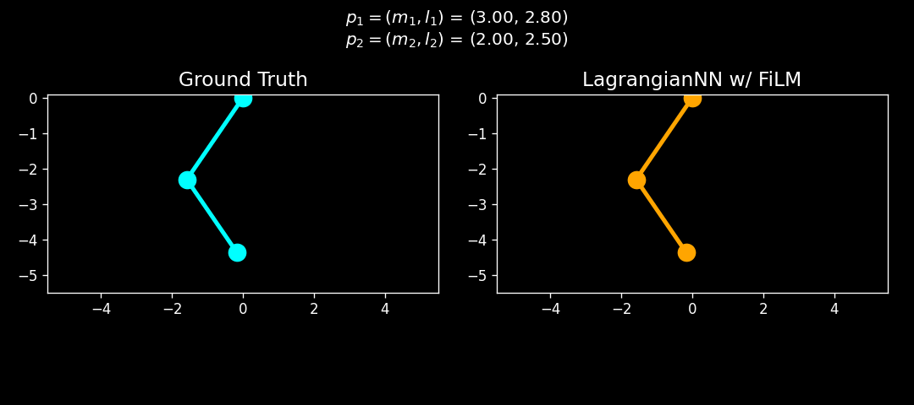
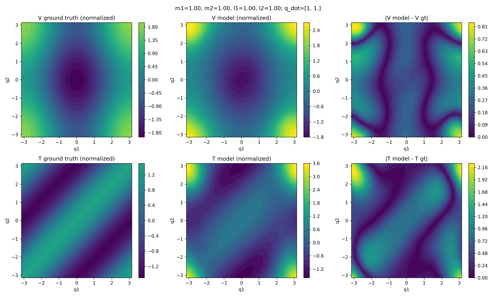

# Lagrangian-FiLM NN

_Read more details about the work [here](https://matteocorbetta.github.io/lagrangian-film-nn/)_

Small fun project on parameter-conditioned Lagrangian neural networks for double-pendulum dynamics in `JAX/Equinox`. 
Took inspiration from the original paper [Cranmer et al., Lagrangian Neural Network 2020](https://arxiv.org/pdf/2003.04630), but extended the application to a family of double pendula with different masses and rod lengths, instead of a single double pendulum.

**In a Nutshell**:

This repository learns a structured mechanics model from simulated trajectories of a double pendulum with varying masses and rod lengths. The model combines:

- a learned Lagrangian formulation that satisfies the always positive-definite mass matrix $M(q, \dot{q})$,
- a Feature-wise Linear Modulation (FiLM)-conditioned kinetic branch that helps generalizing the original model to the family of pendula with different $m$, $l$,
- a learned potential branch,
- automatic differentiation of the Euler-Lagrange equations,
- rollout-based evaluation on held-out and out-of-distribution parameter settings.

You can learn more on the details on the documentation page.

**Blind test of ground truth vs. model given same initial conditions**:


## What The Model Learns

The core network takes:

- generalized coordinates (angular positions) and velocities $\boldsymbol{q} = [q_1, q_2, \dot{q}_1, \dot{q}_2]^{\top}$ $\rightarrow$ `[q1, q2, w1, w2]`,
- physical parameters $\boldsymbol{\theta} = [m_1, m_2, l_1, kl_2]^{\top}$ $\rightarrow$ `[m1, m2, l1, l2]`,

and predicts the generalized accelerations $\ddot{q} = [\ddot{q}_1, \ddot{q}_2]^{\top}$ $\rightarrow$ `[q1_tt, q2_tt]`.

Internally, it learns a structured Lagrangian
$$L(\boldsymbol{q}, \dot{\boldsymbol{q}}, \boldsymbol{\theta}) = T(\boldsymbol{q}, \dot{\boldsymbol{q}}, \boldsymbol{\theta}) - V(\boldsymbol{q}, \boldsymbol{\theta})$$

where:

- the kinetic term is built from a positive-definite matrix parameterization,
- the kinetic branch is FiLM-conditioned by the physical parameters,
- the potential branch depends on both configuration and parameters,
- accelerations are recovered by differentiating the learned Lagrangian rather than directly regressing dynamics with an unconstrained MLP.

## Core Scripts

- `src/lnn/model.py`: FiLM-conditioned `LagrangianNN`
- `src/data/doublependulum.py`: analytical double-pendulum dynamics and energy functions
- `src/data/generate_dataset.py`: synthetic trajectory generation
- `src/train.py`: training loop and optimization
- `src/inference.py`: held-out rollouts, energy plots, and OOD tests
- `src/simulate.py`: RK4 rollout utilities
- `results/visualization.py`: GIF and phase-space visualization tools
- `docs/`: MkDocs site content

## Training And Evaluation Workflow

The current workflow is:

1. Generate analytical trajectories for double pendulums with sampled masses and lengths.
2. Build supervised tensors with augmented state vector `[q1, q2, w1, w2, m1, m2, l1, l2]`.
3. Normalize velocities, parameters, and acceleration targets.
4. Train `LagrangianNN` with Huber loss plus an energy-conservation regularizer.
5. Roll out the learned model with RK4.
6. Compare held-out and OOD trajectories, phase portraits, and learned energy drift.

## Sample Results

### Learned Phase Portraits

The model reproduces the overall phase-space structure reasonably well on in-distribution test trajectories.


### Out-Of-Distribution Behavior

The repository also includes manual OOD tests over masses and rod lengths outside the training range.
When masses and lengths are too far from the training distribution, results start differing qualitatively, as seen below. 



### Structural Validation

The codebase includes a kinetic/potential decomposition check that compares learned structure against the analytical system over a grid of configurations.
The MLP to estimate the kinetic energy clearly shows some errors at the edges of the variable space, mainly because of the lack samples in that range in the training set. 
Moreover, the shape of the potential $V$ is approximately right, but the MLP for the potential is not constrained to the physical behavior of having the minimum at (0,0). This is also something that needs to be improved.


## Quick Start

The repository currently implies `uv` as the preferred environment manager via `uv.lock`.

Install dependencies:

```bash
uv sync
```

Generate a dataset:

```bash
uv run python src/data/generate_dataset.py
```

Train a model:

```bash
uv run python src/train.py
```

Run inference, held-out rollouts, and OOD tests:

```bash
uv run python src/inference.py
```

Generate animations and phase plots from saved rollout artifacts:

```bash
uv run python results/visualization.py
```

Build the docs:

```bash
uv run mkdocs serve
```

## Docker Smoke Test

The repository also supports a minimal Docker verification path. This is a Linux CPU-only smoke test intended to confirm that the locked environment builds cleanly and that the core JAX stack imports inside a container.

Build the image from the repository root:

```bash
docker build -t lagrangiannn .
```

Run the container smoke test:

```bash
docker run --rm lagrangiannn
```

The default container command is:

```bash
uv run python -c "import jax, equinox, optax; print('smoke test ok')"
```

If you are running this on a Mac, Docker Desktop is still executing a Linux container in a lightweight VM. This verifies Linux-in-Docker behavior, not native macOS execution.

## Current Limitations

- The implementation is specialized to a 2-DoF double pendulum.
- Several scripts rely on hard-coded model names and example parameter sets.
- The training code is script-first rather than a packaged CLI workflow.
- The learned energy regularizer acts on a normalized, model-induced quantity, not the exact physical Hamiltonian in original units.
- Some repository metadata still needs cleanup, such as the placeholder package name in `pyproject.toml`.


## Inspiration Papers for this work

### DeLaN

- Deep Lagrangian Networks (Lutter et al., ICLR 2019)
  - Paper: <https://arxiv.org/abs/1907.04490>
  - Code: <https://github.com/milutter/deep_lagrangian_networks>

<!-- ### Energy-Based Control Extension

- DeLaN for energy-based control (Lutter et al., IROS 2019)
  - Paper: <https://arxiv.org/abs/1907.04489> -->

### Lagrangian Neural Networks

- Lagrangian Neural Networks (Cranmer et al., 2020)
  - Paper: <https://arxiv.org/abs/2003.04630>

<!-- ### Context-Aware And Floating-Base Variants

- Context-Aware DeLaN / CaDeLaC (Schulze et al., 2025)
  - Paper: <https://arxiv.org/abs/2506.15249>
- Floating-Base DeLaN / FeLaN (Schulze et al., 2025)
  - Paper: <https://arxiv.org/abs/2510.17270> -->
