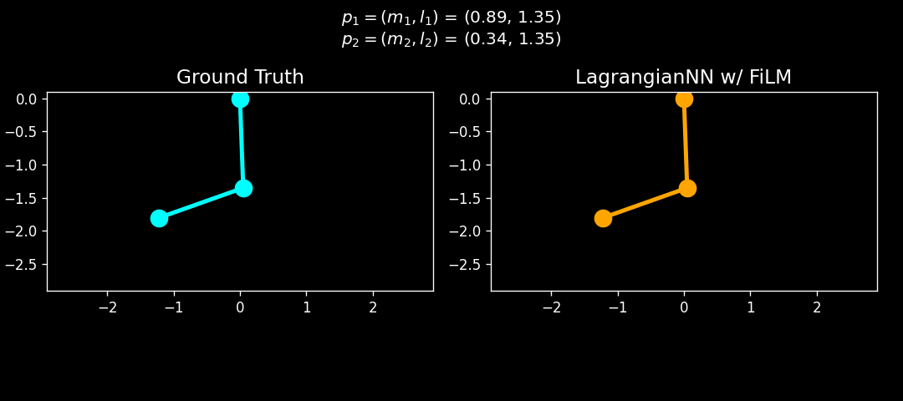

# Lagrangian FiLM NN

This repo is a compact mechanics-meets-ML project: learn the dynamics of a double pendulum, but not just for one fixed setup. The goal is to train a single structured model that can handle a family of pendula with different masses and rod lengths.

The starting point is the main Lagrangian-network idea from [Cranmer et al., Lagrangian Neural Network 2020](https://arxiv.org/pdf/2003.04630), 
plus a more structured kinetic-energy design in the spirit of [Lutter et al. Deep Lagrangian Networks: Using Physics as Model Prior for Deep Learning](https://arxiv.org/pdf/1907.04490). 

On top of that, this project adds Feature-wise Linear Modulation (FiLM) conditioning on the kinetic branch so the model can adapt across a family of double pendula instead of learning just one.
It is not a polished package and it is not pretending to be a paper. 

## What This Project Does

Builds a NN model in `JAX` with `Equinox` and `Optax` outer layers that:

- learns a structured Lagrangian in normalized coordinates
- conditions the kinetic branch on pendulum parameters with FiLM
- predicts accelerations by differentiating the learned Lagrangian with JAX

The setup is intentionally narrow: one system, one architecture family, 
one concrete implementation path.

## What To Read First

- [Background](background.md): the Lagrangian mechanics idea and the Lagrangian-network viewpoint
- [How The Model Works](how-the-model-works.md): architecture choices, FiLM conditioning, loss design, and training details
- [Results](results.md): successes, failures, current limitations, and next steps
- [API](api.md): source modules if you want to inspect the code directly

## Repo Map

- `src/data/`: analytical double-pendulum dynamics, sampling, and dataset generation
- `src/lnn/`: the `LagrangianNN` model
- `src/train.py`: training loop and checkpoint saving
- `src/inference.py`: rollout evaluation, normalized-energy plots, and OOD tests
- `src/simulate.py`: RK4 rollout utilities
- `results/`: plotting and animation helpers
